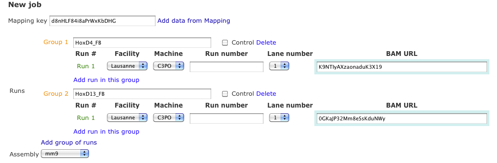
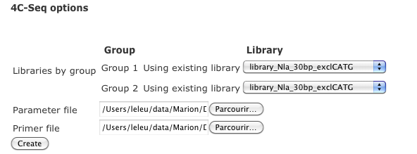

4C-seq Tutorial
===============

Here is a short tutorial showing how you can easily launch a ``4c-seq`` analysis from the interface http://htsstation.vital-it.ch/4cseq/.

Get aligned data?
-----------------
A 4C-seq analysis works from aligned data, given as BAM file(s) through the URL field (there is one BAM file per run). 
The URL can be given directly (as a http:// or ftp:// address accessible from outside) or retrieved by using the `Mapping key` obtained when running the `mapping module<http://htsstation.vital-it.ch/mapseq/>`. In such case, fields related to the sequencing facility (`#Run, Facility, Machine, Run number and Lane number`) might be automatically filled in if relevant (see tutorial of mapseq for more details about those fields).   
The image bellow shows how such key can be used. In this example, data were not coming directly from a sequencing facilty, so the corresponding fields are left empty.  

You can add as many groups and as many runs per group you want by using the links `Add group of runs` and `Add run in this group` (see tutorial xxx for a more detailed explanation of what are groups and runs). In a 4C-seq analysis, several runs in one group means that all reads coming from the different datasets will be merged up for the analysis. Defining several Groups will run an analysis on different datasets simultaneously (e.g., several viewpoints). 
Do not forget to name each group. This name is used for naming the results files as well as in the reports. This name should be identical to the one used in the primer file (see `4C-seq options`). Make sure to use short names without any space (prefer "_" character to separate words) or special characters in it (e.g,  %&?! ...) 

Finally, you will have to select an assembly on the list. Make sure you are selecting the one used for the mapping! If your assembly is not listed, please send us an `email<mailto:webmaster.bbcf@epfl.ch>`.

 
General Parameters
------------------

Name your analysis. Please, use short names, without any spaces (prefer "_" character to separate words) or special characters (e.g., %&?! ... ).  
Finally, submit the relevant informations if you want to receive an email upon completion of the pipeline.

.. image:: images/4Cseq_newJob2.png

4C-Seq options
--------------

A 4C-seq analysis requires a library (one per group) as well as one primer file (see below for details). 

A library consists on a list of segments which composed the fragments with details required to discriminate between informative and invalide fragments. The format is really strict (a detailed description will be given shortly), for this reason, we strongly suggest to either use an existing library or to create it by giving a simple parameter file (see description below). If you plan to re-use a library many times, it might be interesting to add it to our list of existing libraries. In such case, please send us an `email<mailto:webmaster.bbcf@epfl.ch>`.   

Library parameter file
----------------------

This file contains the basic information required for the creation of a new library. 
Below is an example of such file::

    Genome name=mm9
    Primary restriction site (e.g., CATG for NlaIII)=CATG
    Secondary restriction site (e.g., GATC for Dpn)=GATC
    Segment length(default:30bps)=30
    Library name (default:myLibrary)=library_mm9_30bps
    type (typeI or typeII)=typeI        

The type of the library depends on the position of your secondary restriction site. TypeI corresponds to ... why in a typeII, ...

To make sure you keep the same formatting, you can use our template available here (http://...paramLib_template.txt)

Primer file
-----------

A primer file is a simple fasta file containing information about each primer/viewpoint concerned by the current 4C-seq analysis.
Below is a simple example of such file::

    >Dlx1|AATTACCGAGACTAATACGTGCACATG|chr2:71368682-71370007|CATG|CATGTGGGTTTCTGTTTTCCAGCAGGGCATTGTGTGCTCG|CGAGCACACAATGCCCTGCTGGAAAACAGAAACCCACATG|CATGCAGCACAATGCAATAACAATAAAGAAAATTTAAAAC|GTTTTAAATTTTCTTTATTGTTATTGCATTGTGCTGCATG|CATGTGCACGTATTAGTCTCGGTAATTATTTATTGCGTAG|CTACGCAATAAATAATTACCGAGACTAATACGTGCACATG|Exclude=chr2:71366177-71372007
    AATTACCGAGACTAATACG
    >Dlx2|GGGGTGGGGTGGCTCATG|chr2:71387207-71387987|CATG
    GGGGTGGGGTGGCTCATG

Headers contain information relative to each individual primer, such as the full primer’s sequence, the site of the primary restriction enzyme used (e.g. CATG for NlaIII), a list of sequences to be filtered (such as undigested or self-ligated sequences) and optionally the region surrounding the bait to be excluded from the normalization. 
Fields must be separated by the character "|" (pipe - usually Alt+7) without any space in between, and order should be respected. 

Header::

    1. >
    2. primer's name (without any special character)
    3. full primer's sequence, including the appropriate restriction site (e.g., AGATCT for BglII or CATG for Dpn)
    4. bait's coord
    5. primary restriction enzyme (e.g. CATG for NlaIII)
    6. (optional) sequences to filter separated by the character "|" . Examples of such sequences are undigested, self-ligated and bait sequences (ideally 40bp long. Complete with "---" otherwise). Both forward and reverse sequences should be given separately. 
    7. (optional) a region surrounding the bait that can be excluded from the analysis (reads and fragments falling into this regions will be excluded). If any, the coordinates of this region should be precede by the string Exclude=. Multiple regions should be separated by a comma "," (e.g., Exclude=chr2:74521560-74562637,chr2:74601162-74604549)

Sequence::

    Put the 1st x bps of your primer sequence (this sequence will be used during the read separation process. We suggest to set x to n-3, n being defined in the parameter file)  

