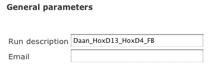

4C-seq Tutorial
===============

Here is a short tutorial showing how to launch a 4c-seq analysis from the interface http://htsstation.vital-it.ch/4cseq/.

Get aligned data?
-----------------
A 4C-seq analysis works from aligned data, given as BAM file(s) through the URL field (there is one BAM file per run). 
The URL can be given directly (as a http:// or ftp:// address accessible from outside) or retrieved by using the `Mapping key` obtained when running the `mapping module <http://htsstation.vital-it.ch/mapseq/>`_. In such case, fields related to the sequencing facility (`#Run, Facility, Machine, Run number and Lane number`) might be automatically filled in if relevant (see tutorial of mapseq for more details about those fields).   
The image bellow shows how such key can be used. In this example, data were not coming directly from a sequencing facilty, so the corresponding fields are left empty.  

You can add as many groups and as many runs per group you want by using the links `Add group of runs` and `Add run in this group` (see tutorial xxx for a more detailed explanation of what are groups and runs). In a 4C-seq analysis, several runs in one group means that all reads coming from the different datasets will be merged up for the analysis. Defining several Groups will run an analysis on different datasets simultaneously (e.g., several viewpoints). 
Do not forget to name each group. This name is used for naming the results files as well as in the reports. This name should be identical to the one used in the primer file (see `4C-seq options`). Make sure to use short names without spaces (prefer "_" character to separate words) and without any special characters in it (e.g,  %&?! ...) 

Finally, you will have to select an assembly from the list. Make sure you are selecting the one used for the mapping! If your assembly is not listed, please send us an `email <mailto:webmaster.bbcf@epfl.ch>`_.

 
General Parameters
------------------

Name your analysis. Please, use short names, without spaces (prefer "_" character to separate words) and without any special characters (e.g., %&?! ... ).  
Finally, submit the relevant information to receive an email upon completion of the pipeline.

4C-Seq options
--------------

A 4C-seq analysis requires a library (one per group) as well as one primer file (see below for details). 

A library is a list of restriction fragments with quality parameters that allow discrimination between valid and invalid fragments. The format is highly specific (a detailed description will be given shortly) and for this reason we recommend to either use an existing library or to create a new library by providing a library parameter file (see description below). If a library will be used many times, we can add it to our list of predefined libraries. In this case, please contact us by `email <mailto:webmaster.bbcf@epfl.ch>`_.   

.. image:: images/4Cseq_newJob3.png

Library parameter file
----------------------

This file contains the basic information required for the creation of a new library. 
Below is an example of such file::

    Genome name (e.g., mm9)=mm9
    Primary restriction site (e.g., CATG for NlaIII)=CATG
    Secondary restriction site (e.g., GATC for DpnII)=GATC
    Segment length(default:30bps)=30
    Library name (default:myLibrary)=library_mm9_30bps
    Type (typeI or typeII)=typeI        

The primary restriction site is the sequence recognized by the first restriction enzyme (i.e. before decrosslinking). The secondary restriction site is the sequence recognized by the secondary restriction site (i.e. after decrosslinking). The segment length is the genomic interval adjacent to the restriction site from which reads are taken into account (we advice a length of 30 bp). The type of the library (typeI or typeII) depends on the design of the inverse 4C-seq primers. If the inverse forward primer is aimed towards the primary restriction site, the library is typeI. If the inverse forward primer is aimed towards the secondary restriction site, the library is type II.

To ensure the use of consistent formatting, we advise to use the following :download:`template <params_library_template.txt>`

Primer file
-----------

A primer file is a `fasta` file containing information about each primer/viewpoint used in the 4C-seq analysis.
Below is an example of such file::

    >HoxD13|AAAATCCTAGACCTGGTCATG|chr2:74504332-74506317|CATG|CATGGTCAAATTCAAACCCGGAGGGTCTCTCCAGGTTTTT|AAAAACCTGGAGAGACCCTCCGGGTTTGAATTTGACCATG|CATGGCGCGCTGCGCCTCCTCCCTCCTCGCTGTGTTCCGC|GCGGAACACAGCGAGGAGGGAGGAGGCGCAGCGCGCCATG|CATGACCAGGTCTAGGATTTTTAAAAGTTATACAAATTCT|AGAATTTGTATAACTTTTAAAAATCCTAGACCTGGTCATG|Exclude=chr2:74501237-74508317
    AAAATCCTAGACCTGGTCA
    >HoxD4|AGGACAATAAAGCATCCATAGGCGACATG|chr2:74561329-74562566|CATG
    AGGACAATAAAGCATCCAT

The header contains information about each individual primer. The sequence is the primer sequence previously used during the de-multiplexing.

Header::

    1. >
    2. primer name (without any spaces or special characters). Should be exactly the same as the groups name!
    3. primer sequence extended up to the restriction site (e.g., CATG for NlaIII)
    4. coordinates of the restriction fragments used as viewpoint
    5. sequence recognized by the primary restriction enzyme (e.g. CATG for NlaIII)
    6. (optional) sequences to be filter out, separated by the character "|" . Examples of such sequences are undigested, self-ligated and bait sequences. Ideally, both forward and reverse complement sequences of 40bp long are given. Shorter or incomplete sequences can be filled in with "---". 
    7. (optional) regions that should be excluded from the analysis (e.g. a region surrounding the viewpoint) Reads and fragments overlapping with this region will be excluded. The input for these coordinates should be preceded by the string "Exclude=". Multiple regions may be separated by a comma "," (e.g., Exclude=chr2:74521560-74562637,chr2:74601162-74604549)

Fields must be separated by the character "|" (pipe - usually Alt+7) without spaces in between, and order should be respected.

Sequence::

    The sequence of your primer. For optimal results, we suggest to truncate the sequence as defined by n-3 (as defined in the parameter file for de-multiplexing).  

