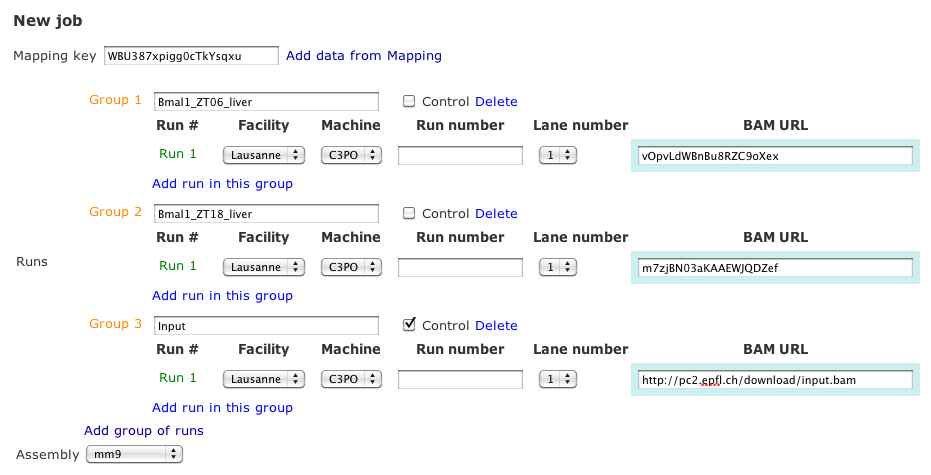

ChIP-seq Tutorial
=================

In this short tutorial we explain the ChIP-seq analysis workflow behind the interface `ChIP-seq <http://htsstation.vital-it.ch/chipseq/>`_ interface.

For details about the underlying methods, please refer to the following paper: `Rey G, et al., PLoS Biol., 2011 <http://www.ncbi.nlm.nih.gov/pubmed/21364973>`_.

Import aligned data
-------------------

Aligned data in `BAM <http://samtools.sourceforge.net/>`_  can be obtained directly from the output of a `Mapping <http://htsstation.vital-it.ch/mapseq/>`_ job or via a URL or a file path.

MACS peak calling
-----------------

The `MACS <http://liulab.dfci.harvard.edu/MACS/index.html>`_ v1.4.0 software is used on the BAM files to perform peak detection. Parameters are given as follows, for every pair `(sample.bam, control.bam)`:
 * -t sample.bam -c control.bam -f BAM -g genome_size -s read_length -m 5,60 --bw=200 -p .001

If no sample is tagged as a `control` the `-c` option is ommitted.
Output files returned are 
 * sample_vs_control_peaks.xls (annotated table of peaks)
 * sample_vs_control_negative_peaks.xls (peaks found in the control, if available)
 * sample_vs_control_peaks.bed (bed file of enriched regions)
 * sample_vs_control_summits.bed (bed file of peak summits) 

Peak deconvolution
------------------

This option will run the `deconvolution algorithm` described in the supplementary methods `file <http://www.plosbiology.org/article/fetchSingleRepresentation.action?uri=info:doi/10.1371/journal.pbio.1000595.s018>`_ of the Rey et al. paper.

The algorithm will analyse ChIP-seq signal within each MACS enriched region and produce a deconvolved density and a refined peak list.

MEME motif search
-----------------

Using the list of MACS peaks (or the refined list if deconvolution was run), the corresponding 
genomic sequences are extracted and used as input to the `MEME <http://meme.nbcr.net/meme4_6_1/meme-intro.html>`_ software, using the following options:
 * -nmotifs 4 -revcomp -dna -maxsize 10000000

The full results directory is provided as a tar archive, together with all motif logos and motif sites.
