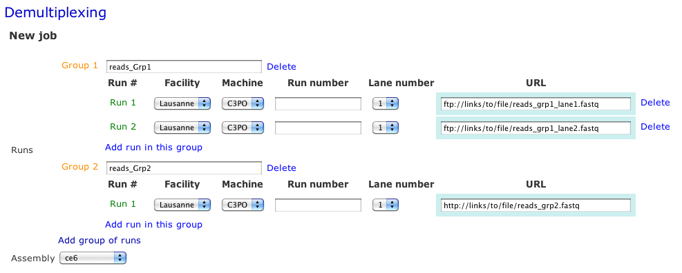
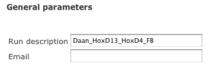
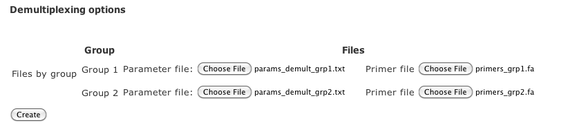

Demultiplexing Tutorial
=======================

Here is a short tutorial showing how to demultiplex barcoded reads with the `demultiplexing interface <http://htsstation.vital-it.ch/demultiplexing/>`_ of `htsstation <http://htsstation.vital-it.ch/>`_.

This module will separate barcoded reads into individual files and prepare the reads for further analysis (e.g., remove barcode and truncate the reads up to a given length). This version works for single-end data in fastq format. 

For details about the underlying method, please refer to the `mutliplex method page` (in preparation)

.. doc/images/demultiplex_general_params_empty.png  doc/images/demultiplex_newJob_2Grps_withRep.png  doc/images/demultiplex_options_2grps.png

Get Reads?
----------

The fastq file can be retrieved directly from the sequencing facility (see general explanation here) or through a given URL (as a http:// or ftp:// address accessible from outside).
The image bellow gives an example for multiple groups and runs of sequences.

Defining several groups (with `Add group of runs`) means that the demultiplexing will be done separately for each group of runs. When a group is composed by several runs (defined with `Add run in this group`), then all the reads coming from the different datasets will be merged up and considered as a single fastq file. 

Do not forget to name each group. This name is used for naming the results files as well as in the reports. This name should be identical to the one used in the primer file (see `demultiplexing options`). Make sure to use short names without spaces (prefer "_" character to separate words) and without any special characters in it (e.g,  %&?! ...) 

 
General Parameters
------------------

Name your analysis. Please, use short names, without spaces (prefer "_" character to separate words) and without any special characters (e.g., %&?! ... ).  
Finally, submit the relevant information to receive an email upon completion of the pipeline.

Demultiplexing options
----------------------

The demultiplexing process requires one parameter file as well as one primers file per group. 
Basically, the parameter file contains options for the demultiplexing itself, while the primers file gives details about the primer design. 
See below for more details about each file.  

Parameter file
--------------

The current method underlying the demultiplexing process is based on `Exonerate <http://www.ebi.ac.uk/~guy/exonerate/>`_, a tool which returns all the pairwise alignments that are above a given threshold (defined by `minScore`).
Here is the command line used for this step::

    exonerate --model affine:local -o -4 -e -12 -s minScore 

As the alignment score depends on the length of the sequences being aligned, we recommand to adjust it to your situation (see `Exonerate Manual <http://www.ebi.ac.uk/~guy/exonerate/exonerate.man.html>`_ for more details). In the following example, the score has been set up for a sequence of length 22. 

In addition, to maximize the accuracy of the results, we limit the alignments to the first bps of each reads. This is defined by the two first parameters (`Search the primer...` ). We also limit the lengths of the barcodes to be search and advise to keep the same length for all. This is defined in the primer file (See description below)

The last parameter defines the length of the sequence for each read that will be kept for further analysis, after having removed the barcode. 

::

    Search the primer from base i (-n)=2
    Search the primer in the next n bps of the reads [i to i+n] (-x 22)=22
    Minimum score for Exonerate (-s 77)=77
    Length of the reads to align (-l 30)=30

To ensure the use of consistent formatting, we advise to use the following :download:`template <params_demultiplexing_template.txt>`

Primer file
-----------

A primer file is a `fasta` file containing information about each barcode supposingly present in the reads.
Below is an example of such file::

    >HoxD13|AAAATCCTAGACCTGGTCATG|chr2:74504332-74506317|CATG|CATGGTCAAATTCAAACCCGGAGGGTCTCTCCAGGTTTTT|AAAAACCTGGAGAGACCCTCCGGGTTTGAATTTGACCATG|CATGGCGCGCTGCGCCTCCTCCCTCCTCGCTGTGTTCCGC|GCGGAACACAGCGAGGAGGGAGGAGGCGCAGCGCGCCATG|CATGACCAGGTCTAGGATTTTTAAAAGTTATACAAATTCT|AGAATTTGTATAACTTTTAAAAATCCTAGACCTGGTCATG|Exclude=chr2:74501237-74508317
    AAAATCCTAGACCTGGTCA
    >HoxD4|AGGACAATAAAGCATCCATAGGCGACATG|chr2:74561329-74562566|CATG
    AGGACAATAAAGCATCCAT

The header contains information about each individual primer. The sequence is the primer sequence previously used during the de-multiplexing.

Header::

    1. >
    2. primer name (without any spaces or special characters). Should be exactly the same as the groups name!
    3. primer sequence extended up to the restriction site (e.g., CATG for NlaIII)
    4. coordinates of the restriction fragments used as viewpoint
    5. sequence recognized by the primary restriction enzyme (e.g. CATG for NlaIII)
    6. (optional) sequences to be filter out, separated by the character "|" . Examples of such sequences are undigested, self-ligated and bait sequences. Ideally, both forward and reverse complement sequences of 40bp long are given. Shorter or incomplete sequences can be filled in with "---". 
    7. (optional) regions that should be excluded from the analysis (e.g. a region surrounding the viewpoint) Reads and fragments overlapping with this region will be excluded. The input for these coordinates should be preceded by the string "Exclude=". Multiple regions may be separated by a comma "," (e.g., Exclude=chr2:74521560-74562637,chr2:74601162-74604549)

Fields must be separated by the character "|" (pipe - usually Alt+7) without spaces in between, and order should be respected.

Sequence::

    The sequence of your primer. For optimal results, we suggest to truncate the sequence as defined by n-3 (as defined in the parameter file for de-multiplexing).  

