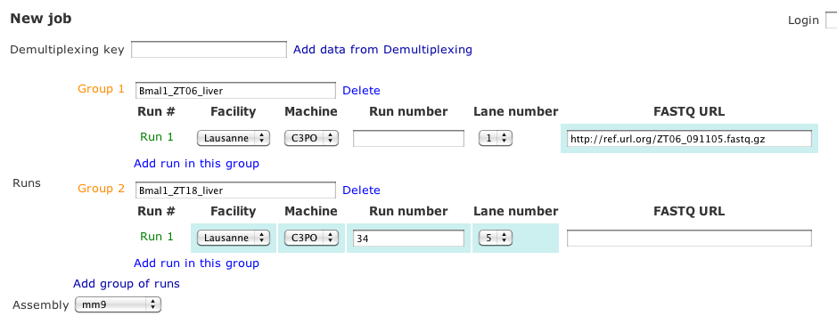
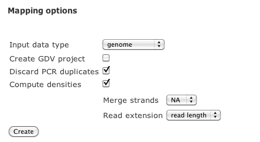

Mapping Tutorial
=================

This is a short description of the options available in the `mapping interface <http://htsstation.vital-it.ch/mapseq/>`_ application, which is practically an interface to the `Bowtie <http://bowtie-bio.sourceforge.net/>`_ software with a few additional post-processing options as described in `Leleu M, Lefebvre G, Rougemont J, Brief Funct Genomics, 2010<http://www.ncbi.nlm.nih.gov/pubmed/20861161>`_.

Provide Reads
-------------

Reads files can be specified in several different ways. First they can be obtained as the output of a  `demultiplexing job <http://htsstation.vital-it.ch/demultiplexing/>`_ by specifiying the corresponding key.

For non-demultiplexed jobs, the original `Fastq <http://en.wikipedia.org/wiki/FASTQ_format>`_ file must be provided either as a reference to the sequencing facility LIMS, by a URL or a file path (on the server-side filesystems).

Reads files are organized by `groups` (experimental conditions) and `runs`(replicates). 
Each group must be given a name that will be used in output file names and reports to reference them.
Make sure to use short names without spaces (prefer "_" character to separate words) and without any special characters in it (e.g,  %&?!;,) 

Choose your reference
---------------------

Reads will be mapped to a reference sequence set, which is identified by an `assembly` (species) and a `data type` which can be either of
 * genome (full chromosome sequences)
 * transcriptome (annotated exon sequences from `Ensembl <http://www.ensembl.org/>`_)

The corresponding Bowtie indexes have been generated by the `Genrep <http://bbcftools.vital-it.ch/genrep/>`_  application from reference sequences from NCBI and Ensembl.

Job description
---------------

Please give a name to your analysis that can be refered to later, in particular in the email that will be sent to the address provided:

.. image:: images/4Cseq_newJob2.png

Bowtie options
--------------

Default Bowtie options are 
 * --best --strata --chunkmbs 512 -Sam 20
Output is converted to `BAM <http://samtools.sourceforge.net/>`_ (file `sampleName_complete.bam`) then filtered to retain only the mapped reads with at most **5** hits in the reference. If the `Discard PCR duplicates` option is given, only at most **n** reads per strand-specific genomic position will be kept, where **n** is computed as the 95% percentile of a Poisson distribution with the same mean as the expected genome coverage. These filtered hits will be provided as the `sampleName_filtered.bam`.

Mapping report
--------------

Each mapping run will generate a :download:`mapping report <mapping_report.pdf>` displaying some general statistics about the Bowtie mappings (number of mismatches compared to reference, number of multiple hits, forward/reverse strand balance). 

Densities output
----------------

For reads mapped to the genome, a read density file can be generated. This will provide genomic position-specific reads counts normalized by total number of reads (in units of 10 millions), where each multiple mapping read is counted as **1/total count**. 
Reads are extended to a specified length (by the default the read length of the sequencing run). If `merge strands` is specified as **NA**, two strand-specific densities are produced, if a number **S** is given as `merge strands` value, then a single density is calculated as the sum of the two strands after shifting each by **S** bases in downstream direction. **S**  should therefore correspond to half the average sequencing fragment length.

These densities are available in the results page as `sqlite <http://bbcf.epfl.ch/twiki/bin/view/BBCF/SqLite>`_ and `bigwig <http://genome.ucsc.edu/goldenPath/help/bigWig.html>`_ formats. If `Create GDV project` is specified, the files will be uploaded in a new project on `GDV <http://svitsrv25.epfl.ch/gdv/>`_.

