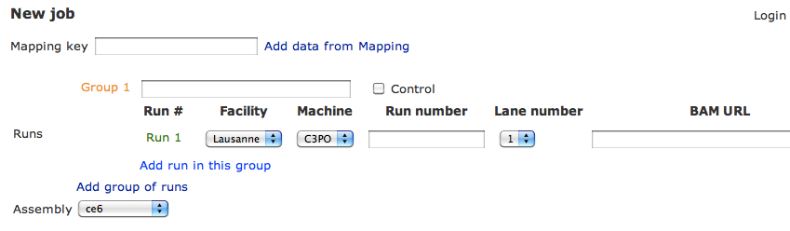
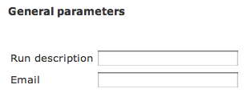
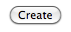
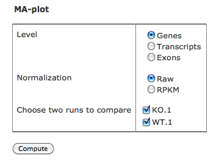
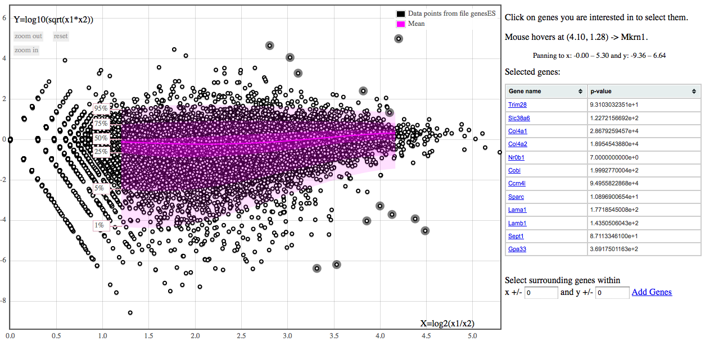

RNA-seq
=======

Here is a short tutorial showing how to launch a RNA-seq analysis from HTSstation's `web interface <http://htsstation.epfl.ch/rnaseq/>`_.

New Job
-------

An RNA-seq analysis works from reads aligned on a reference genome or exonome, given as BAM file(s) through the BAM URL field (there is one BAM file per run). Each BAM file represents a sample ("run"); several samples that were produced in the same conditions (replicates) form a "group".

The BAM URLs can be given directly as an `http://` or `ftp://` address accessible from outside. You can add manually as many groups and as many runs per group you want by using the links `Add group of runs` and `Add run in this group`. Each sample will then be labeled *group_name.run_index* in the output files. Make sure to use short group names, without spaces (prefer the "_" character to separate words) and without any special character in it (e.g. "%&?!"). Groups are considered to represent different experimental conditions, while runs typically represent techical replicates. This is important for statistical analysis - see below.

If you used the HTSstation `mapping module <http://htsstation.epfl.ch/mapseq/>`_ to do the mapping, you can copy the 20-random characters keys obtained as a result into the `Mapping key` field, and validate using the link `Add data from Mapping`. In such case, all relevant fields will be automatically filled in (see tutorial of our `mapping module <http://htsstation.epfl.ch/mapseq/>`_ for more details about those fields). To add samples from other independant mappings, successively enter the correponding keys and click on `Add data from Mapping`.

Then select an assembly from the list. Make sure you are selecting the one that was used for the mapping. If your assembly is not listed, please send us an `email <mailto:webmaster.bbcf@epfl.ch>`_.

Name your analysis in the `Analysis description` field. Preferably use short names, without any special characters (e.g. "%&?!"). Submit your e-mail in order to receive a message upon completion of the pipeline.

Finally, click on the `Create` button and confirm to launch the job.

Results
-------

When the job finishes successfully, you will receive an e-mail with a link to the page where you can download the results. Results consist in tab-delimited files containing counts and rpkm for genes, exons and transcripts, and a differential expression analysis for each pair of groups in the experiment.

Counts tables, named "<type>_expression.tab", contain columns named "<prefix>.<sample>.<run_id>", where <prefix> is "counts." for raw counts, "norm." for inter-sample normalized counts (using DESeq's "size factors"), or "rpkm." for transcript-size normalized counts.
Genomic features with zero counts in all conditions will not be reported.

.. note::

    The latter is not the RPKM as it was initially defined. Instead of dividing by the library size, we use median-scaling (DESeq's "size factors"), then divide by the transcript size.

.. note::

    First reads are counted in exons and the exons table & stats are produced. Then junction reads are added and genes/transcripts expression calculated. Hence possible differences between gene count and the sum of its exons', for instance.

Differential analysis is performed on raw counts (by DESeq) and results are summarized in the files named "<type>_differential_<comparison>.txt". Columns "pval" and "padj" are respectively gene-level and adjusted p-values.

.. warning::

    Differential expression analysis will not be very reliable if there are no replicates (i.e. only one run per group): in this case all groups will be pooled and the variation between them considered as background biological variability. Prefer considering fold changes over p-values if you have no or few replicates.

Interactive MA-plot
-------------------

From there you can also create an interactive MA-plot to look for differential transcript expression.

1. Select the type of genomic features you want to compare (`level`);
2. Select the type of normalization to apply to the data (`raw` for untransformed count data, or `RPKM`);
3. Select the two samples you want to compare from you data (`Choose runs to compare` checkboxes);
4. Click on the `Compute` button.

On the graph's page, click on a point you are interested in to display its name in the column on the right. Click on it again to remove it from the list. Click on the name to get information about the selected feature from Ensembl. Note that the graph may take a long time to load and react if there are a lot of features to draw.

Functionalities:

* If you select several runs from the same group, they will be averaged and considered as a single sample in the MA-plot.
  For instance, one can select *KO.1*, *KO.2*, *KO.3*, *WT.1* and *WT.2* to compare groups *KO* and *WT*.
* Use the `Zoom in` and `Zoom out` buttons to zoom on the graph. You can retrieve the original view with the `Reset` button.
  Translate the graph by holding the mouse button and sliding the figure.
* Use the `Search` field to retrieve in the plot a gene given by its name or ID.
* Use the `Select surrounding features` fields to highlight all genes nearest to the last selection.
* Use the `Clear` button to remove all selections.
