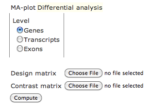

RNA-seq
=======

Here is a short tutorial showing how to launch a RNA-seq analysis from the interface http://htsstation.vital-it.ch/rnaseq/.

New Job
-------

A RNA-seq analysis works from aligned data, given as BAM file(s) through the BAM URL field (there is one BAM file per run). Each BAM file represents a sample ("run"); several samples that were produced in the same conditions (replicates) form a "group".

.. warning:: Alignments have to be performed on the **exonome**.

.. note::  If the alignment was performed on something else than the exonome, you can still retrieve the read counts on the features you aligned to in the output file that is supposed to contain the counts on exons.

The BAM URLs can be given directly as an `http://` or `ftp://` address accessible from outside. You can add manually as many groups and as many runs per group you want by using the links `Add group of runs` and `Add run in this group`. Each sample will then be labeled *group_name.run_index* in the output files. Make sure to use short group names, without spaces (prefer "_" character to separate words) and without any special character in it (e.g. "%&?!" ).

If you used the HTSstation `mapping module <http://htsstation.vital-it.ch/mapseq/>`_ to do the mapping, you can copy the 20-random characters keys obtained as a result into the `Mapping key` field, and validate using the link `Add data from Mapping`. In such case, all relevant fields will be automatically filled in (see tutorial of our `mapping module <http://htsstation.vital-it.ch/mapseq/>`_ for more details about those fields). To add several samples, successively enter the correponding keys and click on `Add data from Mapping`.

.. image:: images/RNAseq_newjob.png

Then select an assembly from the list. Make sure you are selecting the one that was used for the mapping. If your assembly is not listed, please send us an `email <mailto:webmaster.bbcf@epfl.ch>`_.

Name your analysis in the `Run description` field. Please, use short names, without spaces (prefer "_" character to separate words) and without any special characters (e.g., "%&?!" ... ).
Submit your e-mail in order to receive an message upon completion of the pipeline.

.. image:: images/RNAseq_generals.png

Finally, click on the `Create` button and confirm to launch the job.

.. image:: images/RNAseq_create.png

Results
-------

When the job finishes successfully, you will receive an e-mail with a link to the page where you can download the results. Results include mapping reports for each sample, and tab-delimited files containing counts and rpkm for genes, exons and transcripts for all samples at once.

Interactive MA-plot
-------------------

From there you can also create an interactive MA-plot to look for differential transcript expression.

* Select the `MA-plot` option;
* select the type of genomic features you want to compare (`level`);
* select the type of normalization to apply to the data (`raw` for untransformed count data, or `RPKM`);
* select the two samples you want to compare from you data (`Choose two runs to compare` checkboxes);
* click on the `Compute` button.

.. image:: images/RNAseq_create_maplot.png

On the graph's page, click on the points you are interested in to display its name in the column on the right. Click on it again to remove it from the list. Click on the name to get information about the selected feature from Ensembl. Note that the graph may take a long time to load and react if there are a lot of features to draw.

.. image:: images/RNAseq_maplot.png

Differential expression analysis
--------------------------------

The module also provides analysis of differential transcript expression.

* Select the `Differential analysis` option;
* select the type of genomic features you want to compare (`Genes`, `Transcripts` or `Exons`);
* if you want to model the data with a GLM, add a design matrix and a contrast matrix (see below);
* click on the `Compute` button.

By default, it will use the `DESeq package <http://www.bioconductor.org/packages/2.6/bioc/vignettes/DESeq/inst/doc/DESeq.pdf>`_ .

It is also proposed to fit the data with a negative-binomial-based GLM (see `methods <http://bbcf.epfl.ch/bbcflib/_downloads/methods_rnaseq.pdf>`_) instead. In this case, the user has to specify

* a design matrix in the following format: ::

          group1   group2     group3
    T     30       40         40
    tr    1        1          0
    Ch    0        1          1

    where T, tr, Ch are examples of different covariates defining the groups.

* a contrast matrix in the following format: ::

                      group1   group2     group3
    group1 - group2   1        -1         0
    T30 - T40         1        -0.5       -0.5

A text file is returned containing the results.

