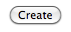

SNP
===

Here is a short tutorial showing how to search for SNPs from the interface http://htsstation.epfl.ch/snp/.

This module will compare the sequence of aligned reads to a reference genomic sequence to find all
single-nucleotide variants (Single Nucleotide Polymorphism, SNP) and the codon variations they induce.

New Job
-------

An SNP analysis works from aligned data, given as BAM file(s) through the BAM URL field (there is one BAM file per run). Each BAM file represents a sample ("run"); several samples that were produced in the same conditions (replicates) form a "group". All runs of the same group will be merged before the analysis.

The BAM URLs can be given directly as an `http://` or `ftp://` address accessible from outside. You can add manually as many groups and as many runs per group you want by using the links `Add group of runs` and `Add run in this group`. Each sample will then be labeled *group_name.run_index* in the output files. Make sure to use short group names, without spaces (prefer "_" character to separate words) and without any special character in it (e.g. "%&?!" ).

If you used the HTSstation `mapping module <http://htsstation.epfl.ch/mapseq/>`_ to do the mapping, you can copy the 20-random characters keys obtained as a result into the `Mapping key` field, and validate using the link `Add data from Mapping`. In such case, all relevant fields will be automatically filled in (see tutorial of our `mapping module <http://htsstation.epfl.ch/mapseq/>`_ for more details about those fields). To add samples from other independant mappings, successively enter the correponding keys and click on `Add data from Mapping`.

Then select an assembly from the list. Make sure you are selecting the one that was used for the mapping. If your assembly is not listed, please send us an `email <mailto:webmaster.bbcf@epfl.ch>`_.

Name your analysis in the `Run description` field. Please, use short names, without spaces (prefer "_" character to separate words) and without any special characters (e.g., "%&?!" ... ).
Submit your e-mail in order to receive a message upon completion of the pipeline.

.. image:: images/RNAseq_generals.png

Finally, click on the `Create` button and confirm to launch the job.

Results
-------

When the job finishes successfully, you will receive an e-mail with a link to the page where you can download the results. A first tab-delimited file contains the position, type and quality of all SNPs found in each group.

For SNPs occuring inside of an exon, another tab-delimited file indicates the exon an gene ID, as well as the original and modified codons.

Bed tracks are provided to be loaded in the UCSC genome browser to visualize the SNP positions. Note that you can load them in UCSC or GDV by clicking directly on the `View in UCSC | View in GDV` links at the bottom of the results page.

Criteria
--------

The following rules are applied to decide whether to annotate an SNP:

* There must be at least 5 reads supporting the SNP.
* If there are less than 10, an asterix will be added in front of the variant base in the output file.
* If all reads support the SNP, the variant base is indicated.
* If the variant is supported by only a fraction of the reads, this fraction must be at least 40%/20% of the total number of reads, respectively for procaryotes and eucaryotes. Moreover, there must be at least 5 reads supporting the SNP on each strand. In this case, it is annotated as <variant><x%>/<reference><total-x%>.
* If there are two diferrent variants, the fraction of reads supporting each of them must be at least 20%/10% of the total, respectively for procaryotes and eucaryotes. Moreover, there must be at least 3 reads supporting each variant on each strand. In this case, it is annotated as <variant1><x%>/<variant2><y%>.
* If the variant is not present in one of the samples, the result file will show the reference base instead.
* If there is no coverage at this position in one of the samples, it will be annotated as "0".

